<!-- # ThinkTweet - An AI Argumentator/Analyzer -->

# What is ThinkTweet?

ThinkTweet is a project designed to analyze claims made on X and estimate how reliable those claims are.

The goal is to encourage better discussion by identifying weak reasoning, pseudoscience, misogyny, hatred toward minority groups, and unsupported claims, while also encouraging people to question authority and examine the evidence behind an argument.

> **Currently, this project is limited to feminism-related topics. Period.**

<a href="https://thinktweet.meetnoman.com/" target="_blank">Visit Live ThinkTweet Website</a>

<br>

# Why I built this?

I am Indian, and I have seen a clear problem with how people discuss topics online. People often tweet something without checking their own biases, looking for supporting data, or questioning whether the claim is actually true.

It often feels like people are living inside their own information bubbles. Another problem is how quickly people label others just to discredit them instead of actually addressing their argument.

Over time, this toxicity also entered discussions around human rights.

Around the same time, I was thinking about building a project related to women's safety or feminism. Honestly, I could not think of a unique problem to solve.

Eventually, I decided to build something that analyzes claims made on Twitter/X and initially restrict it to feminism-related topics. The goal is to encourage better and more evidence-based feminist discourse.

The project will expand into other domains later.

<br>

# Project Structure

```text
ThinkTweet/
├── backend/
│   ├── node_modules/
│   ├── src/
│   ├── .env
│   ├── index.js
│   ├── package-lock.json
│   └── package.json
│
├── frontend/
│   ├── node_modules/
│   ├── public/
│   ├── src/
│   ├── eslint.config.js
│   ├── index.html
│   ├── package-lock.json
│   ├── vite.config.js
│   └── package.json
│
├── docs/
│   ├── diagrams/
│   └── images/
│
├── README.md
└── .gitignore
```

<br>

# Screenshots

<table>
  <tr>
    <td>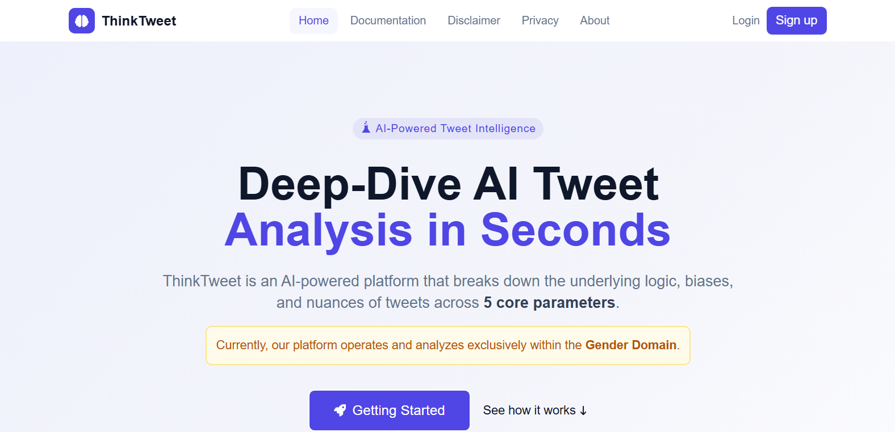</td>
    <td>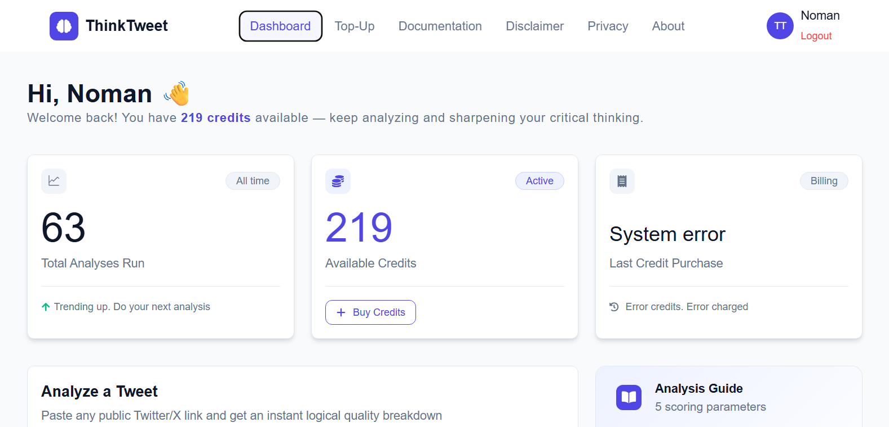</td>
  </tr>
  <tr>
    <td>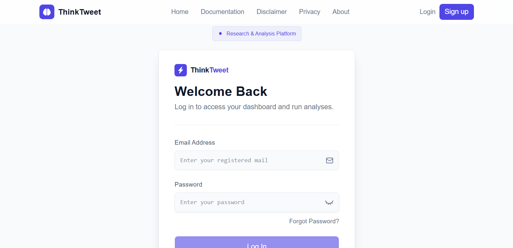</td>
    <td>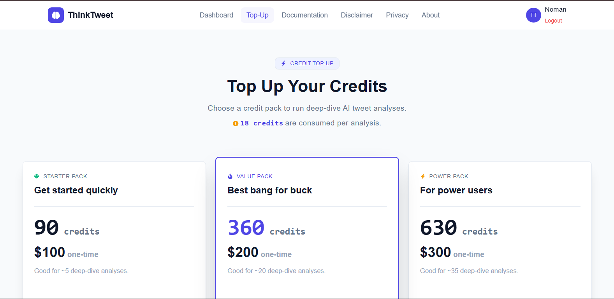</td>
  </tr>
  <tr>
    <td>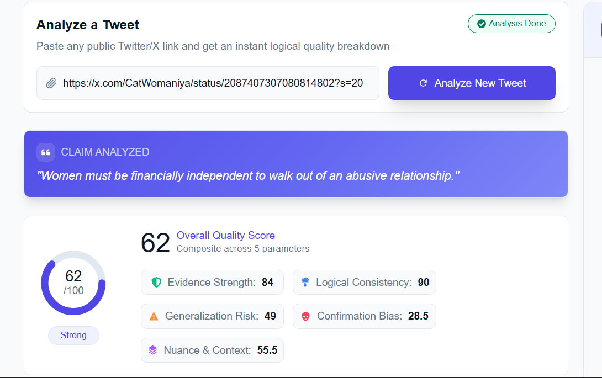</td>
    <td>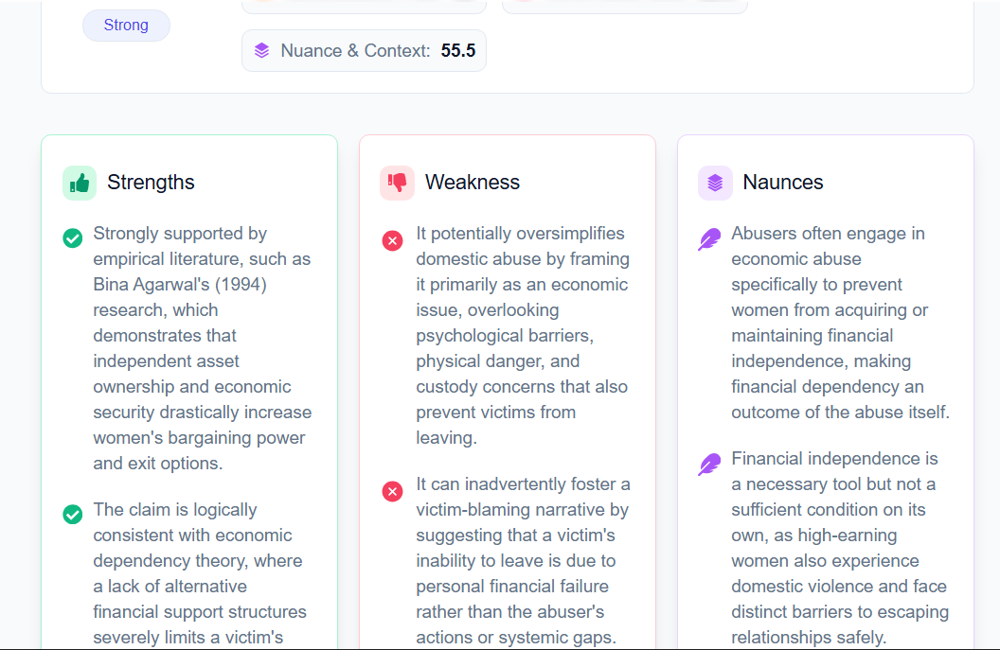</td>
  </tr>
</table>

<br>

# Engineering Overview

The entire project is mainly built around five important areas: **Analysis, Login, Sign Up, Authentication, and Payment**.

Rather than explaining thousands of lines of code, I am choosing to explain the important engineering decisions, how the different parts connect, and why I built them this way.

## 1. Analysis

This section goes deeper into how the analysis feature was built, the thinking behind it, and how the different components are connected through a modular structure.

### <u>Architectural / System-flow Diagram</u>

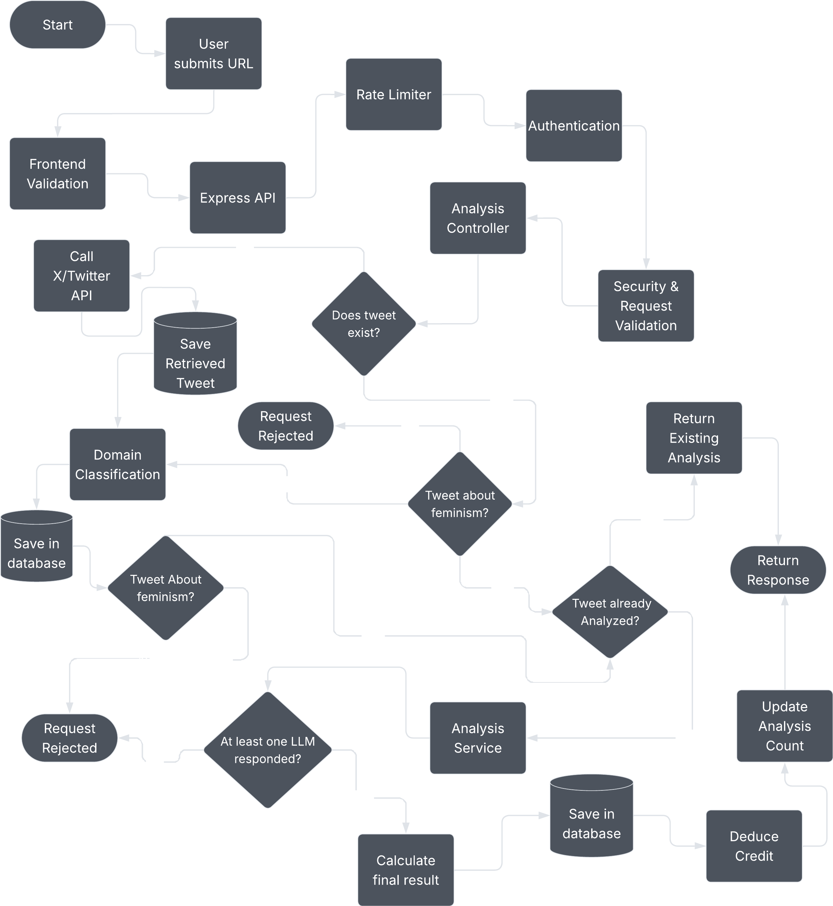

<br>
<br>

**Unable to see the diagram?** <a href="https://drive.google.com/file/d/1gy36OWkTx71e4YzqSarouyQ44OVXq6Gm/view?usp=sharing" target="_blank">Download the diagram</a>

### <u>Quick Questions?</u>

<details>
<summary>Click here to see the questions and answers</summary>

<br>

<b>Why not accept direct links to tweets? Wouldn't that save a lot of development time?</b>

<br>

That's a good idea. If I accepted claims directly, I would not need to deal with Twitter/X API calls, multiple validation checks, and caching.

But the goal was not to analyze every argument from everywhere.

If this project scales, accepting arguments from multiple platforms could dramatically increase LLM costs. There was also another reason: I was already tired of the amount of arguments and hate I saw on Twitter/X, so I wanted to keep the scope focused.

For now, ThinkTweet accepts X claims and verifies that the submitted claim actually comes from X. The system retrieves the claim through the X API instead of allowing users to submit arbitrary text.

This solves an important problem while keeping the scope of the project controlled.

<br>
<br>

<b>Why are there relatively few lines in each file? Why not keep more functionality inside larger files?</b>

<br>

The main reason is maintenance.

I have built a few projects in the past, and maintaining large files became difficult for me. I also don't like having thousands of lines of functionality sitting inside one file because it creates a massive amount of information to process at once.

So I chose a modular structure.

It solves two problems for me: **maintainability and mental overload**.

Each part of the system has a smaller responsibility, which makes the code easier to understand and maintain.

<br>
<br>

<b>Why is the project limited to feminism?</b>

<br>

I will be completely honest about this.

I could have started with politics, economics, atheism, the environment, or many other important topics. But there is a problem: how would I know whether the model is responding correctly?

To properly evaluate the model, I need a strong understanding of the subject itself. I need to know whether the model is following the argument standards and whether it is missing important context.

I have a decent understanding of atheism and politics, but I have spent years studying and thinking about feminism. Because of that, I currently have a better understanding of the common patterns, arguments, logical flaws, and missing context in this area.

That makes feminism a practical starting point for testing and improving the system.

I can also improve the model by giving it more research papers, opinions, arguments, and logical patterns.

Is the model responding perfectly right now?

Obviously not.

It is still a newly built system, and I can already see places where it misses context. Over time, I want to improve it as I collect more data points and understand where the model fails.

Will it always be limited to feminism?

No.

The plan is to slowly expand into other topics. Since this is a personal project, I am intentionally choosing to grow it slowly rather than trying to cover everything at once.

</details>

### <u>Security Measures & Other Practices</u>

* Requests are limited to 5 per 15 minutes to reduce spam and unnecessary server usage.
* The request goes through 5 dedicated validation layers to reject unexpected requests and reduce the risk of malicious input.
* An authentication layer protects sensitive routes from unauthenticated requests.

<br>

## 2. Login

This section explains how the login pipeline is built, how it is secured, and the reasoning behind the decisions.

### <u>Architectural / System-flow Diagram</u>

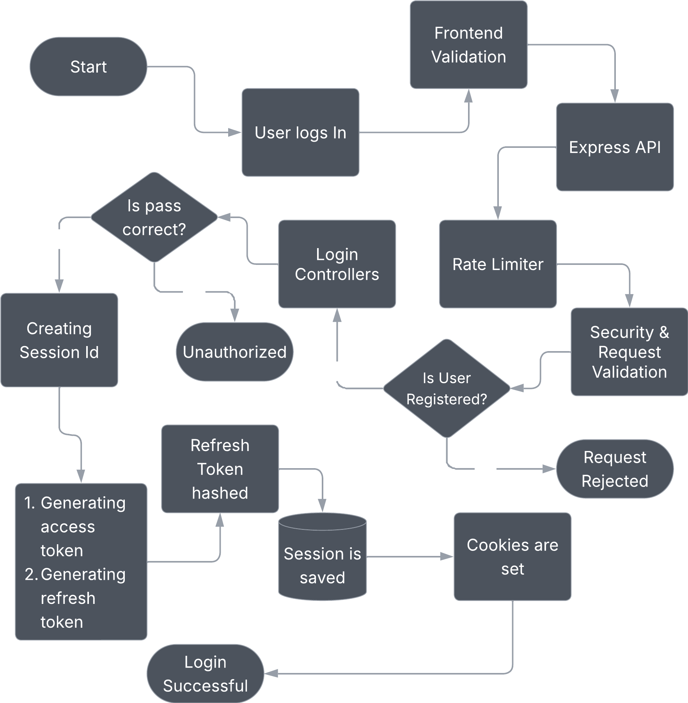

<br>
<br>

**Unable to see the diagram?** <a href="https://drive.google.com/file/d/163V45pLE4Oam5IR2JNks7wn3ZQx0dwsM/view?usp=sharing" target="_blank">Download the diagram</a>

### <u>Quick Questions?</u>

<details>
<summary>Click here to see the questions and answers</summary>

<br>

<b>How long do the tokens remain valid?</b>

<br>

The access token expires after 10 minutes.

The refresh token has a maximum lifetime of 7 days.

<br>
<br>

<b>Why is the refresh token saved in the database if JWT is supposed to be stateless?</b>

<br>

The short answer is security.

The access token expires every 10 minutes. After that, the refresh token is used to generate a new access token.

But what happens if the refresh token is somehow stolen?

Even though the refresh token is stored in an HTTP-only cookie and stealing it is difficult, I still wanted a way for the server to detect a compromised session.

A common approach would be to simply refresh the tokens again and continue the session. But in that case, the server has no direct way to know whether the person using the refresh token is the actual user or an attacker.

The attacker could potentially continue using the session for the entire 7-day refresh-token lifetime.

So I chose to store a hashed version of the refresh token in the database and compare it before issuing new tokens.

This gives the server a way to detect when the refresh token no longer matches the expected session.

This approach is not perfect either.

Detection still depends on the refresh token being used again. If a user is not using the website and an attacker has somehow obtained the session, there is no request from which the server can detect the problem.

I prefer this trade-off because it gives the server an additional point of control instead of relying entirely on stateless JWT validation.

<br>
<br>

<b>Is it safe to keep the refresh token in the database? What happens if the database is compromised?</b>

<br>

The refresh token is hashed using Argon2 before it is stored.

This means the original refresh token is not stored directly in the database. Even if the database is compromised, the stored value cannot simply be used as the original token.

</details>

### <u>Security Measures & Other Practices</u>

* Refresh tokens are hashed using Argon2 before being stored.
* Sessions are automatically removed after the 7-day refresh-token lifetime.
* Tokens are stored in HTTP-only cookies to reduce the risk of client-side JavaScript accessing them.
* Multiple validation checks are performed before sensitive operations are processed.

<br>

## 3. Sign Up

This section explains how the signup, verification, and account creation pipeline is designed.

### <u>Architectural / System-flow Diagram</u>

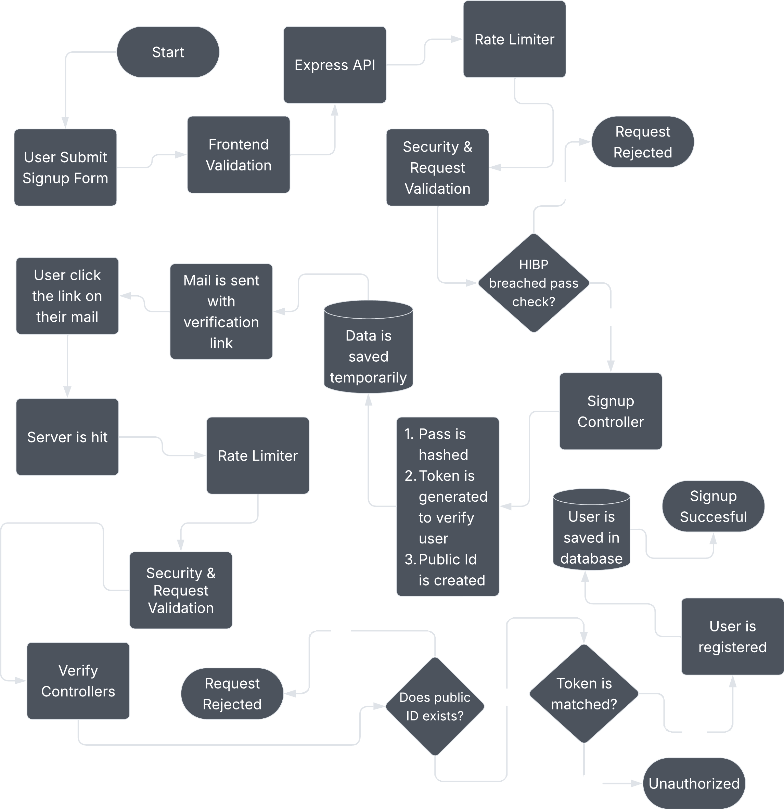

<br>
<br>

**Unable to see the diagram?** <a href="https://drive.google.com/file/d/1viUtxFGLh-NSFCzzE1eYxNRKUYDVJMx3/view?usp=sharing" target="_blank">Download the diagram</a>

### <u>Quick Questions?</u>

<details>
<summary>Click here to see the questions and answers</summary>

<br>

<b>How is the user verified?</b>

<br>

After all required checks pass, a verification link is generated containing a public ID and a verification token.

Before sending the link, the required data is temporarily stored so that the credentials can be matched later.

When the user clicks the verification link, the server checks the credentials contained in the link against the stored data.

If they match, the account is successfully registered.

<br>
<br>

<b>How is breached-password verification handled?</b>

<br>

I use the Have I Been Pwned (HIBP) API for this.

The user's actual password is never sent to HIBP or another external server.

Instead, the password is processed using HIBP's k-anonymity approach, and the server receives only the information required to check whether the password appears in known breaches.

The server then checks the result against the password that was entered.

In addition, ThinkTweet requires a minimum password length of 14 characters, which provides another layer of protection against weak passwords.

</details>

### <u>Security Measures & Other Practices</u>

* Multiple accounts cannot be created using the same email address.
* A minimum password length of 14 characters is required.
* Passwords are checked against known breaches.
* Email verification is required before registering the account.
* Passwords are hashed using Argon2.

<br>

## 4. Authentication

### <u>Architectural / System-flow Diagram</u>

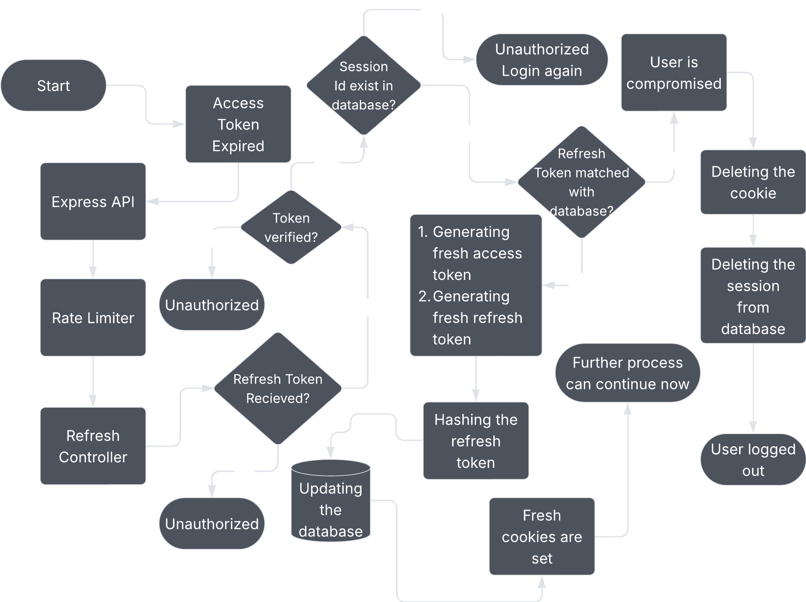

<br>
<br>

**Unable to see the diagram?** <a href="https://drive.google.com/file/d/1pTHjiYyRamgTG7-GjONspUMfVidlT-TM/view?usp=sharing" target="_blank">Download the diagram</a>

### <u>Quick Questions?</u>

<details>
<summary>Click here to see the questions and answers</summary>

<br>

> No question came to mind here, and the necessary questions are already answered in the sections above.

If you have another question about the authentication system, you can contact me at [noman.work@proton.me](mailto:noman.work@proton.me).

</details>

### <u>Security Measures & Other Practices</u>

* Tokens are cross-checked with the database to help detect compromised sessions.
* Refresh tokens are hashed before being stored in the database.
* Multiple checks are performed throughout the authentication flow, and requests can be rejected if they do not match the expected standards.

<br>

## 5. Payment

### <u>Architectural / System-flow Diagram</u>

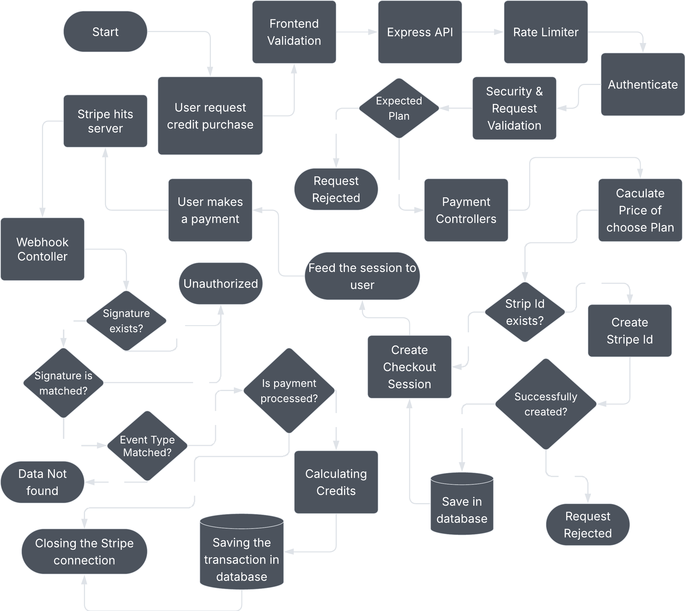

<br>
<br>

**Unable to see the diagram?** <a href="https://drive.google.com/file/d/1a3oa278bgYU8pz6Hg-usNFAIjcuvhMr8/view?usp=sharing" target="_blank">Download the diagram</a>

### <u>Quick Questions?</u>

<details>
<summary>Click here to see the questions and answers</summary>

<br>

<b>Why is a Stripe customer ID generated when users are making one-time top-ups instead of subscriptions?</b>

<br>

You're right that it is not strictly necessary for a one-time payment.

However, it solves an important problem.

Without a Stripe customer ID, Stripe has less context about whether a payment belongs to an existing customer or a completely different one.

It also helps maintain a record of customer-related information and means I don't have to repeatedly provide the same customer information when creating a checkout session.

There is also a future benefit.

If I eventually move from one-time top-ups to subscriptions, this infrastructure will already be in place.

<br>
<br>

<b>Why is the price recalculated on the server?</b>

<br>

This is done to prevent client-side manipulation.

If the server directly trusted the price sent by the client, someone could write a simple Python script, send a very low amount to the server, and potentially trick the system into providing premium credits.

The client therefore does not get to decide the final price.

The server calculates it independently.

<br>
<br>

<b>Why are credits also calculated by the server when the payment is only between Stripe and our server?</b>

<br>

Technically, there would not be a major security problem if the credits were calculated during checkout.

I chose to calculate them after payment for two reasons.

First, many checkout sessions are abandoned. If I allocate or process credits during the checkout process, I would be spending server resources on transactions that may never actually be completed.

Second, calculating the credits after a successful payment gives me another layer of confidence that the allocated credits are based on the actual amount paid.

Instead of depending only on a top-up plan name or ID, the payment amount becomes the direct input for calculating the credits.

This makes the system a little more fail-safe.

<br>
<br>

<b>Why is the payment system running in a sandbox environment?</b>

<br>

I don't currently intend to operate ThinkTweet as a company or use it as a direct source of income.

I simply liked the idea and wanted to build the complete payment infrastructure around it.

So, for now, the payment system is mainly there to demonstrate and test the complete flow rather than to run a real commercial business.

</details>

### <u>Security Measures & Other Practices</u>

* Incoming requests are thoroughly validated and authenticated before further processing.
* Prices and credits are calculated on the server rather than trusted from the client.
* Checkout sessions are used instead of a simple payment page because they provide better tracking of the payment flow and help prevent issues when allocating credits.


<br>

# Tech Stack

### Frontend

* React.js
* JavaScript
* HTML
* Tailwind CSS
* CSS

### Backend

* Node.js
* Express.js

### Database

* MongoDB
* MongoDB Atlas

### Authentication, Verification & Security

* JWT
* Argon2
* Have I Been Pwned (HIBP) API
* Crypto
* Resend

### Payment Partner

* Stripe

### External APIs & AI

* X API
* Gemini API
* Opena AI API
* Qwen API

### Development & Deployment

* Git
* GitHub
* VS Code
* Vercel
* Railway


<br>

# Limitations / Known Issues

ThinkTweet is still an early version of the project, so there are several limitations that I am aware of.

1. The system currently does not use RAG-based analysis to provide a more evidence-based perspective.

2. The caching layer does not use a dedicated caching technology such as Redis. Instead, the system currently relies on MongoDB.

3. If a user forgets their password, there is currently no password reset feature.

4. The system does not use an active method to immediately flag a session if a refresh token is stolen. Instead, it relies on the passive architecture described in the authentication section to detect a compromised session.

5. Users currently cannot view their analysis history or detailed information about previous analyses.

6. Detailed documentation of the project is still missing.

7. Some React components do not yet follow a fully modular structure.

8. Two-factor authentication is not currently implemented.

9. Users cannot select which LLM model they want to use for analyzing their claim.

10. The codebase is currently written in JavaScript instead of a stricter language such as TypeScript.

<br>

> These limitations are part of the next phase of the project. The first phase of ThinkTweet finishes here.

<br>

# Upcoming Phase

In the next phase, I plan to work on several of the limitations mentioned above.

The plan is to gradually move the codebase from JavaScript to TypeScript, migrate React.js to Next.js, and move from MongoDB to PostgreSQL.

I also plan to introduce a dedicated caching layer using Redis and work on the other missing features and improvements mentioned above.

I don't want to rush all of these changes into the first version. Since this is a personal project, I prefer to improve the system gradually and understand the problems before adding another layer of complexity.

<br>

# How to Contact Me?

For any questions, queries, or hiring opportunities, you can contact me at:

**[noman.work@proton.me](mailto:noman.work@proton.me)**

> **Thanks for reaching this far.**
