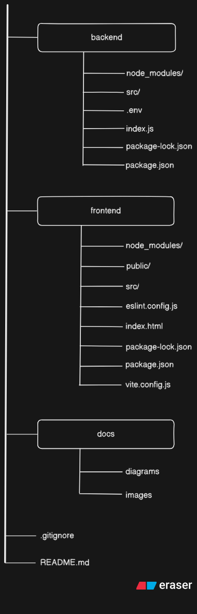
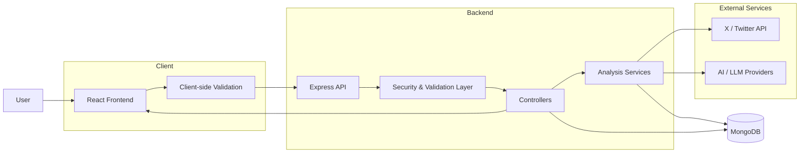
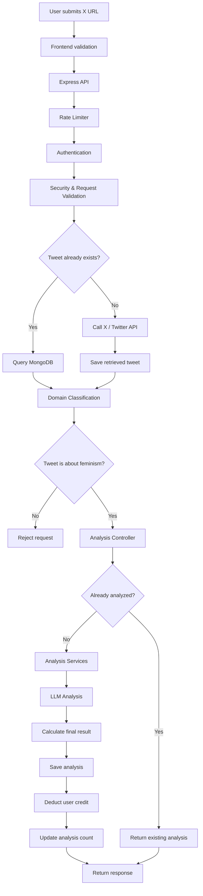

# ThinkTweet - An AI Argumentator/Analyzer

## What is ThinkTweet?
ThinkTweet is a project whose job is to analyze a claim of X's platform and estimate how reliable the claim is. ThinkTweet tries to improve the talking discourse and avoiding any pseudoscience, misogny, hatred against minotory groups and holding the authority's accountablity

> Currently, this project limited to feminism related topics. Period.

## Why I built this?
I am Indian, and I saw clear problem that people are tweeting anything without checking their biasness or googling it look for data. It felt like people are in their own bubble. And the audacity to label someone just to discredit. This toxicity entered into human rights issues also, and during the same time I was thinking to build some project related to woman safety or feminism related. And honestly, I was unable to think about any unique issue to solve. At the end I chose, to analyze the claim of twitter and restrict it to feminism related for better feminist discourse. We are gonna expand the domain later on.

## Project Structure

## Engineering Overview
### Analysis
- #### Architecture

